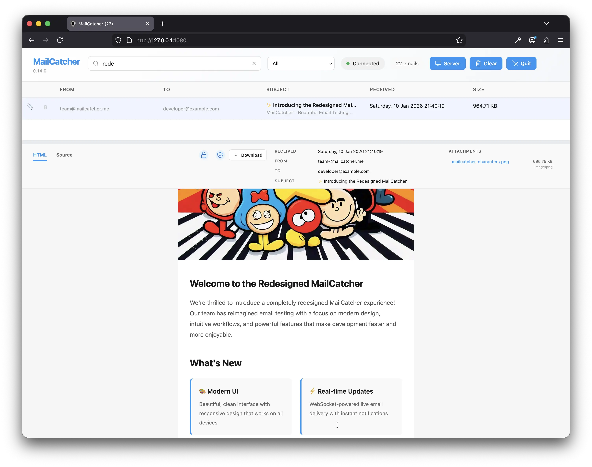

# MailCatcher NG (Next Generation)

[](https://rubygems.org/gems/mailcatcher-ng)
[](https://github.com/spaquet/mailcatcher/actions/workflows/ci.yml)
[](LICENSE)

Catches mail and serves it through a dream.

MailCatcher NG runs a super simple SMTP server which catches any message sent to it to display in a web interface. Run mailcatcher, set your favourite app to deliver to smtp://127.0.0.1:1025 instead of your default SMTP server, then check out http://127.0.0.1:1080 to see the mail that's arrived so far.



## Table of Contents

- [Quick Start](#quick-start)
- [Features](#features)
- [Claude Integration](#claude-integration)
- [Documentation](#documentation)
  - [Installation & Setup](reference/INSTALLATION.md)
  - [Usage & Configuration](reference/USAGE.md)
  - [Framework Integration](reference/INTEGRATIONS.md)
  - [REST API](reference/API.md)
  - [Advanced Features](reference/ADVANCED.md)
  - [Claude Integration Guide](CLAUDE_INTEGRATION.md)
  - [Claude Plugin Setup](reference/CLAUDE_PLUGIN_SETUP.md)
  - [MCP Server Setup](reference/MCP_SETUP.md)
  - [Integration Architecture](reference/INTEGRATION_ARCHITECTURE.md)
  - [Credits](reference/CREDITS.md)
- [License](#license)

## Quick Start

1. `gem install mailcatcher-ng`
2. `mailcatcher`
3. Go to http://127.0.0.1:1080/
4. Send mail through smtp://127.0.0.1:1025

## Features

- Catches all mail and stores it for display
- Shows HTML, Plain Text, and Source versions of messages
- Rewrites HTML for safe display with embedded images
- Downloads original email to view in any mail client
- WebSockets real-time updates with automatic reconnection
- Runs as a daemon in the background, or in foreground mode
- `catchmail` command for PHP and sendmail-compatible systems
- Keyboard navigation between messages
- Email authentication verification (DMARC, DKIM, SPF)
- Email encryption & signature support (S/MIME, OpenPGP)
- BIMI (Brand Indicators for Message Identification) display
- Advanced preview text extraction with intelligent fallback
- Full UTF-8 and 8bit MIME transfer encoding support (SMTPUTF8, 8BITMIME)
- Multiple encoding support (7bit, 8bit, base64, quoted-printable)
- SSL/TLS encryption (STARTTLS & direct TLS/SMTPS)
- Charset preservation for international content

For a comprehensive list of all features, see [FEATURES.md](FEATURES.md).

## Claude Integration

MailCatcher NG integrates seamlessly with Claude through two complementary methods:

### Claude Plugin (Easiest)

Use MailCatcher with Claude.com or Claude Desktop without any installation:

```bash
mailcatcher --plugin --foreground
```

Then add the plugin in Claude settings: `http://localhost:1080/.well-known/ai-plugin.json`

### MCP Server (Programmatic)

Enable programmatic access via Model Context Protocol:

```bash
mailcatcher --mcp --foreground
```

Configure in Claude Desktop's `~/.claude_desktop_config.json`:

```json
{
  "mcpServers": {
    "mailcatcher": {
      "command": "mailcatcher",
      "args": ["--mcp", "--foreground"]
    }
  }
}
```

### Available Tools

Both methods expose 7 powerful tools:

- **search_messages** - Full-text search with filtering
- **get_latest_message_for** - Find latest message for recipient
- **extract_token_or_link** - Extract OTPs, magic links, reset tokens
- **get_parsed_auth_info** - Structured authentication data
- **get_message_preview_html** - Responsive HTML preview
- **delete_message** - Delete specific message
- **clear_messages** - Delete all messages

See [CLAUDE_INTEGRATION.md](CLAUDE_INTEGRATION.md) for complete setup and usage guide.

## Documentation

Detailed documentation is organized by topic:

### [Installation & Setup](reference/INSTALLATION.md)

Get MailCatcher NG up and running. Covers gem installation, source compilation, Docker, and special scenarios like RVM and Bundler.

### [Usage & Configuration](reference/USAGE.md)

Learn how to run MailCatcher NG, command-line options, development mode, and web interface features.

### [Framework Integration](reference/INTEGRATIONS.md)

Configure your framework (Rails, Django, PHP, Docker) to send mail through MailCatcher NG.

### [REST API](reference/API.md)

Programmatic access to messages. Query, download, and manage messages via HTTP.

### [Advanced Features](reference/ADVANCED.md)

SSL/TLS encryption, UTF-8 and international content, email authentication, and more.

### [Claude Plugin Setup](reference/CLAUDE_PLUGIN_SETUP.md)

Use MailCatcher NG as a Claude Plugin for natural language interactions with caught emails. Perfect for testing email workflows with Claude.

### [MCP Server Setup](reference/MCP_SETUP.md)

Configure MailCatcher NG as an MCP server for programmatic access via Claude Desktop and other MCP-compatible clients.

### [Integration Architecture](reference/INTEGRATION_ARCHITECTURE.md)

Deep dive into how the Claude Plugin and MCP integrations work, including protocol specifications, tool definitions, and extension points.

### [Credits](reference/CREDITS.md)

About MailCatcher NG and the original MailCatcher project.

## License

MailCatcher NG is released under the MIT License, see [LICENSE](LICENSE) for details.
